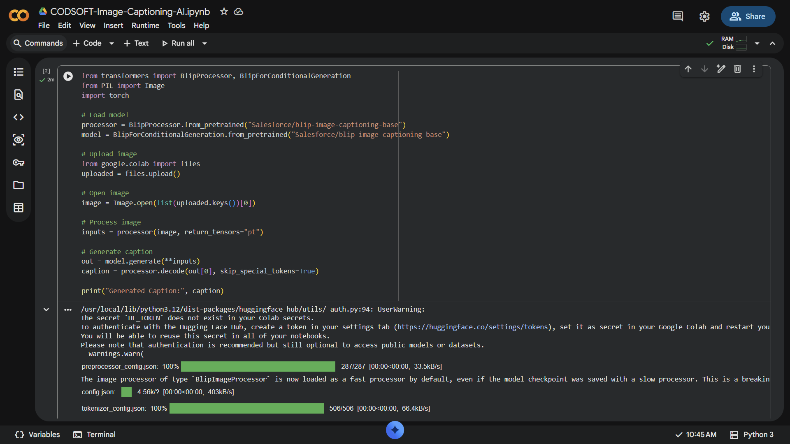

# CODSOFT-Image-Captioning-AI-Task-3-
This project is developed for CODSOFT AI Internship Task 3. It generates captions for images using a pre-trained AI model. This project helped me understand the basics of image processing and NLP.
## Output Screenshots
### Output 1

### Output 2

### Output 3

